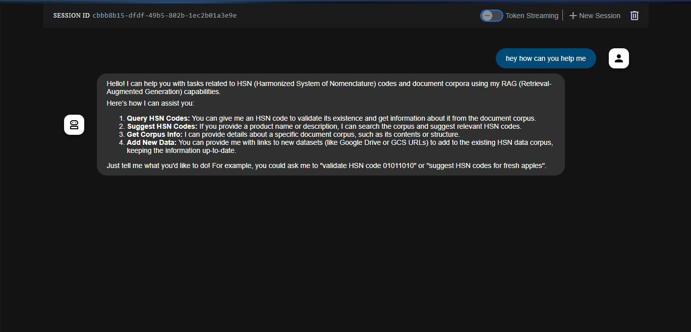
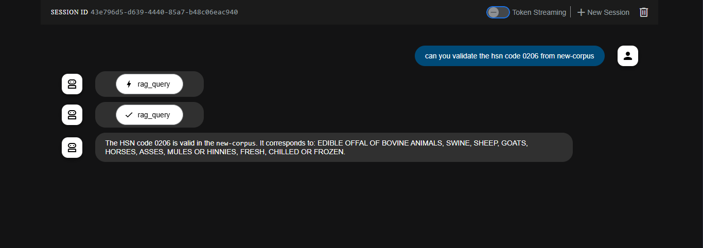
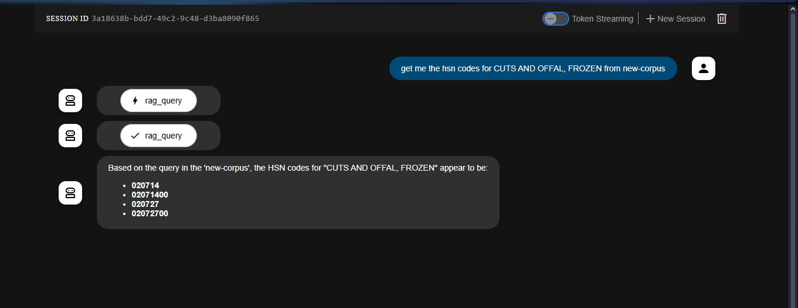
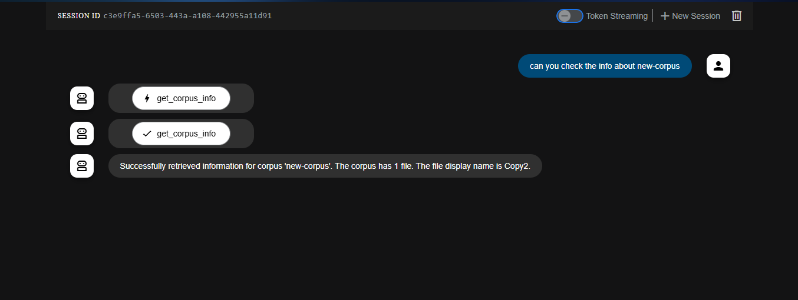

# HSN Code Validation RAG Agent

An intelligent agent built with Google's Agent Development Kit (ADK) that provides HSN (Harmonized System Nomenclature) code validation and suggestions using Retrieval-Augmented Generation.



## 📋 Features

- **HSN Code Validation**: Verify if an HSN code is correctly formatted and exists in the master dataset
- **Corpus Data Management**: Add, query, and get information about document corpora
- **RAG-Powered Recommendations**: Get HSN code suggestions based on product descriptions

## 📸 Screenshots

### Code Validation


### Code Suggestions


### Corpus Information


## 🛠️ Technologies

- Google Agent Development Kit (ADK)
- Vertex AI RAG
- Gemini 2.5 Flash model
- Python 3.9+

## 🚀 Setup

### Prerequisites

- Python 3.9+
- Google Cloud account with Vertex AI access
- Properly configured Google Cloud credentials

### Installation

1. Clone the repository:
```bash
git clone https://github.com/yourusername/hsn-code-validation-agent.git
cd hsn-code-validation-agent
```

2. Create and activate a virtual environment:
```bash
python -m venv venv
source venv/bin/activate  # On Windows: venv\Scripts\activate
```

3. Install dependencies:
```bash
pip install -r requirements.txt
```

### Setting Up Google Cloud Authentication

Before running the agent, you need to set up authentication with Google Cloud:

1. Install Google Cloud CLI:
   - Visit [Google Cloud SDK](https://cloud.google.com/sdk/docs/install) for installation instructions for your OS

2. Initialize the Google Cloud CLI:
```bash
gcloud init
```
This will guide you through logging in and selecting your project.

3. Set up Application Default Credentials:
```bash
gcloud auth application-default login
```
This will open a browser window for authentication and store credentials in: `~/.config/gcloud/application_default_credentials.json`

4. Verify Authentication:
```bash
gcloud auth list
gcloud config list
```

5. Enable Required APIs (if not already enabled):
```bash
gcloud services enable aiplatform.googleapis.com
gcloud services enable cloudresourcemanager.googleapis.com
```

## 📁 Project Structure

```
hsn-code-validation-agent/
├── multi_tool_agent/
│   ├── __init__.py          # Package initialization and main exports
│   ├── agent.py             # Main agent implementation
│   ├── config.py            # Configuration settings
│   └── tools/
│       ├── __init__.py      # Tools package initialization
│       ├── add_data.py      # Tool for adding data to corpus
│       ├── rag_query.py     # RAG-based query implementation
│       ├── get_corpus_info.py # Corpus information retrieval
│       └── utils.py         # Utility functions
├── requirements.txt         # Project dependencies
├── .gitignore              # Git ignore rules
└── README.md               # Project documentation
```

### Key Components

- **agent.py**: Implements the main HSN code validation agent using Google's ADK
- **tools/**: Contains specialized tools for different functionalities:
  - `add_data.py`: Handles corpus data management and ingestion
  - `rag_query.py`: Implements RAG-based querying for HSN code suggestions
  - `get_corpus_info.py`: Provides corpus metadata and statistics
  - `utils.py`: Common utility functions and helpers
- **config.py**: Manages configuration settings and environment variables

### Dependencies

The project relies on the following key packages:
- google-cloud-aiplatform (1.92.0)
- google-cloud-storage (2.19.0)
- google-genai (1.14.0)
- gitpython (3.1.40)
- google-adk (0.5.0)

